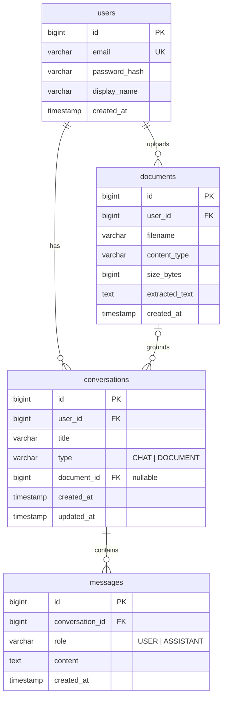

# AI Knowledge Assistant

Full-stack AI knowledge assistant built with Java Spring Boot, React (Vite), PostgreSQL and Google Gemini. Supports persistent AI chat, document Q&A over PDF/TXT uploads, conversation history, and a usage dashboard.

## Live demo

| | URL |
|---|---|
| Frontend | https://ai-knowledge-assistant-xi.vercel.app |
| Backend API | https://ai-knowledge-assistant-api-1nzm.onrender.com |
| API docs (Swagger UI) | https://ai-knowledge-assistant-api-1nzm.onrender.com/swagger-ui.html |

> The backend runs on Render's free tier and spins down when idle, so the first request can take around 50 seconds while the instance starts back up. After that it responds normally.

## Features

1. JWT authentication: register and login with BCrypt-hashed passwords and stateless sessions
2. AI chat assistant: persistent chat backed by Gemini. Messages are stored per user, and conversation titles are generated automatically after the first exchange
3. Document chat: upload a PDF or TXT (up to 5 MB), text is extracted server-side with PDFBox, and questions are answered strictly from the document's content
4. Conversation history: list, resume and delete past conversations
5. Usage dashboard: conversation, message and document counts plus recent activity

## Architecture

```
frontend (React 19 + Vite + Tailwind)          backend (Spring Boot 3.5 / Java 21)
┌─────────────────────────────┐                ┌──────────────────────────────────────┐
│ pages/        (routes)      │   HTTPS/JSON   │ controller/   (REST, validation)     │
│ components/   (reusable UI) │ ─────────────▶ │ service/      (business + prompts)   │
│ context/      (auth state)  │   JWT bearer   │ repository/   (Spring Data JPA)      │
│ api/client.js (fetch layer) │                │ security/     (JWT filter + service) │
└─────────────────────────────┘                │ ai/           (Gemini REST client)   │
                                               └──────────────────┬───────────────────┘
                                                        PostgreSQL │        Gemini API
```

### Backend notes

- Standard Controller → Service → Repository layering. Entities never leave the service layer; every response is a DTO (Java records).
- All prompt building lives in `AiService`: system prompts, history windowing and document context assembly. `GeminiClient` only knows the wire format, so swapping providers means replacing one class.
- `GlobalExceptionHandler` maps domain exceptions (`NotFound`, `Conflict`, `BadRequest`, `AiServiceException`) and validation failures to a single `ErrorResponse` shape with field-level errors.
- Configuration comes from `AppProperties`, a `@ConfigurationProperties` record covering JWT, CORS, Gemini, upload and AI budget settings. Everything can be overridden with environment variables.
- Bean Validation on all request DTOs, plus file type (PDF/TXT only) and size (5 MB) checks on upload.

### Frontend notes

- `AuthContext` owns the token (persisted to `localStorage`), the current user, and login/logout. `ProtectedRoute` gates authenticated pages.
- `api/client.js` is the single fetch wrapper: it attaches the JWT, normalizes errors into a typed `ApiError`, and logs the user out on 401.
- Shared components (`Button`, `Input`, `Card`, `Spinner`, `ErrorBanner`, `EmptyState`, `MessageBubble`, `TypingIndicator`) keep the pages small. Every API call has a loading state and surfaces its errors.

## AI integration

Provider: Google Gemini (`gemini-flash-latest`) through the `generateContent` REST API, used for all AI features. Transient provider errors (429/5xx) are retried once and then routed to a fallback model (`gemini-flash-lite-latest` by default), since the free-tier pool for a single model can be temporarily saturated.

- General chat uses a system instruction covering tone, Markdown output, honesty about uncertainty, and protection against instruction leaking. The last 20 messages of the conversation are replayed as alternating user/model turns, which gives the model context without unbounded token growth.
- Document chat embeds the extracted text in the system instruction with grounding rules: answer only from the document, quote relevant passages, and say when the answer isn't in it. Documents are capped at a 100,000-character budget; when a document is truncated the prompt says so, and the model discloses that only part of it was available.
- Conversation titles come from a separate single-turn prompt after the first exchange. It's best-effort: if the call fails, the chat continues without a title.

### Scaling document chat

Inline context is the right call at this scope. For large corpora the next step would be a retrieval pipeline: chunk documents (500–1,000 tokens with overlap), embed the chunks (e.g. Gemini `text-embedding-004`), store vectors in `pgvector`, and retrieve the top-k chunks by cosine similarity at question time. Citation metadata per chunk and async extraction/embedding for large uploads would follow from that.

## Security

- Passwords are hashed with BCrypt and never returned by any endpoint.
- JWTs (HS384, 24 h expiry) are validated by a filter on every request. Only `/api/auth/**`, Swagger and the health check are public. Secrets come from environment variables.
- Ownership is enforced in the service layer: conversations and documents are always fetched by id + user, so one user can never read another's data. Missing or foreign resources return 404 rather than 403 to avoid leaking which ids exist.
- Bean Validation on all DTOs; uploads are restricted by content type and size in both Spring config and service checks.
- CORS is locked to the deployed frontend origin. Sessions are stateless and CSRF is disabled since no cookies are used.
- Stack traces never leave the server, and AI provider failures are mapped to a generic 502.

## ER diagram



## API

Swagger UI is served by the backend at `/swagger-ui.html` (OpenAPI JSON at `/v3/api-docs`).

| Method | Endpoint | Auth | Description |
|---|---|---|---|
| POST | `/api/auth/register` | no | Create account, returns JWT |
| POST | `/api/auth/login` | no | Login, returns JWT |
| GET | `/api/users/me` | yes | Current user profile |
| GET | `/api/conversations` | yes | List my conversations |
| POST | `/api/conversations` | yes | Start a new chat conversation |
| GET | `/api/conversations/{id}` | yes | Conversation with messages |
| POST | `/api/conversations/{id}/messages` | yes | Send message, returns AI reply |
| DELETE | `/api/conversations/{id}` | yes | Delete conversation |
| GET | `/api/documents` | yes | List my documents |
| POST | `/api/documents` | yes | Upload PDF/TXT, creates a document conversation |
| GET | `/api/dashboard/stats` | yes | Usage summary |

## Local setup

Prerequisites: Java 21, Maven 3.9+, Node 20+, and a Gemini API key ([Google AI Studio](https://aistudio.google.com/apikey), free tier works).

```bash
# Backend (uses in-memory H2 in PostgreSQL mode by default, no DB setup needed locally)
cd backend
GEMINI_API_KEY=your-key mvn spring-boot:run        # http://localhost:8080

# Frontend
cd frontend
npm install
npm run dev                                        # http://localhost:5173
```

To run against PostgreSQL instead of H2, set `DB_URL`, `DB_USERNAME`, `DB_PASSWORD`.

### Backend environment variables (deployed)

| Variable | Purpose |
|---|---|
| `DB_URL` / `DB_USERNAME` / `DB_PASSWORD` | JDBC connection to hosted PostgreSQL |
| `JWT_SECRET` | HMAC signing key (at least 32 chars) |
| `GEMINI_API_KEY` | Gemini API key |
| `CORS_ALLOWED_ORIGINS` | Deployed frontend origin(s), comma-separated |
| `GEMINI_MODEL` | Optional, defaults to `gemini-flash-latest` |
| `GEMINI_FALLBACK_MODEL` | Optional, defaults to `gemini-flash-lite-latest`; used when the primary model is unavailable |

The frontend needs only `VITE_API_URL` (backend base URL) at build time.

## Deployment

- Frontend on Vercel (`frontend/` root, Vite preset, SPA rewrite via `vercel.json`)
- Backend on Render, built from `backend/Dockerfile` (multi-stage Maven build into a JRE image). Docker is out of the assignment's scope and is only there as Render's deploy mechanism for Java
- Database on Neon serverless PostgreSQL (free tier). Schema is managed by Hibernate `ddl-auto: update`, which is fine for an MVP; I'd switch to Flyway migrations for production

## Known limitations and trade-offs

- Render free-tier cold starts (~50 s after idle). A paid instance or a keep-alive ping would fix it.
- No streaming responses (out of scope): replies arrive when complete, with a typing indicator in the meantime.
- Whole-document prompting: anything past the 100k-character budget is truncated, disclosed to both the model and the user. See the retrieval note above for how this would scale.
- AI calls are synchronous, so a slow provider response holds the request thread. Production would move to async processing or streaming.
- `ddl-auto: update` instead of versioned migrations.
- No refresh tokens: a single 24 h JWT keeps auth simple here; production would add rotation.
